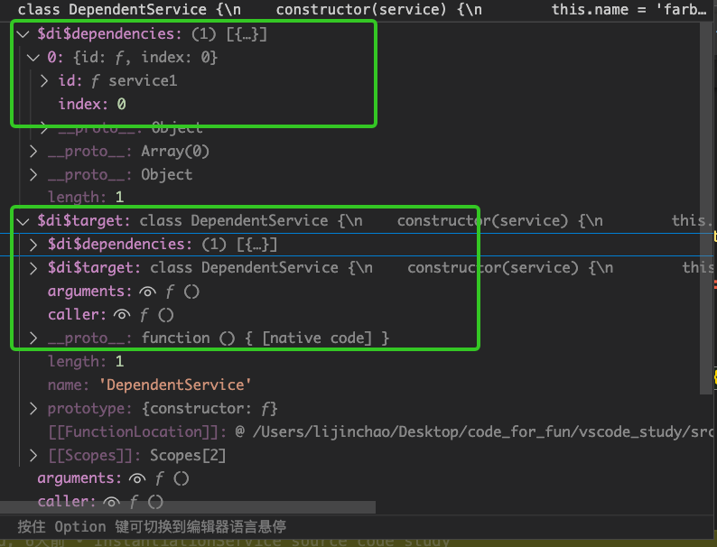

# VSCode - InstantiationService 

阅读VSCode源码是学习和理解该开源项目的一种方式。

在源码中，有一个非常重要且无法绕过的模块，那就是`InstantiationService`。

它是一个依赖注入容器，用于管理类的实例化过程，并提供灵活、易用的服务注册和获取机制。

对于插件开发者来说，它还提供了强大的扩展能力和API支持。

本文将通过阅读`InstantiationService`的源码，解析其实现原理，这对我们后续深入理解VSCode的其他方面有很大帮助。

### 关于源码仓库

`VSCode` 源码仓库代码量巨大，有时候会对我们阅读源码产生一些干扰，不知道怎么下手。

所以，为了方便阅读代码和调试，我把`InstantiationService`的实现部分的代码单独拉出来放到了仓库里: [VSCode-Source-Leaning](https://github.com/jinchaofs/VSCode-Source-Learning)

关于调试，你可以在`vscode`中直接打断点进行调试。

## 依赖注入回顾

在开始分析`InstantiationService`之前，让我们回顾一下依赖注入设计模式的概念和优势。

依赖注入是一种设计模式，帮助我们实现松耦合的组件和可测试的代码。

在依赖注入中，对象不需要自己创建或获取它所依赖的其他对象，而是通过外部注入的方式来提供这些依赖关系。这样可以提高代码的可维护性、可测试性和可扩展性。

举个例子，我们先看一个传统的处理类依赖关系的方式：

```typescript
class Logger {
  log(message: string) {
    console.log(message);
  }
}

class UserService {
  private logger: Logger;

  constructor() {
    this.logger = new Logger();
  }

  createUser(name: string) {
    this.logger.log(`Creating user: ${name}`);
    // 具体的创建用户逻辑
  }
}
```

上述代码中，每个类都需要负责创建它所依赖的`Logger`对象。这样的实现方式导致了类之间的紧耦合关系，同时在测试时很难替换或模拟日志记录功能。

通过使用依赖注入，我们可以改进上述代码：

```typescript
class UserService {
  private logger: Logger;

  constructor(logger: Logger) {
    this.logger = logger;
  }

  createUser(name: string) {
    this.logger.log(`Creating user: ${name}`);
  }
}

const logger = new Logger();
const userService = new UserService(logger);
userService.createUser("Tester");
```

在这个示例中，我们将`Logger`对象作为参数传递给`UserService`类的构造函数，实现了依赖注入。这样就可以在创建`UserService`实例时传入不同的`Logger`对象，实现对日志记录功能的定制或模拟。

通过依赖注入，我们实现了类之间的解耦，并提高了代码的可测试性和可扩展性。特别是在大型应用程序中，依赖注入可以更轻松地管理和替换依赖关系。

## 服务标识符（装饰器）

`InstantiationService` 在实例化对象的过程中，进行依赖注入，有一个很重要的角色，就是 **`服务标识符`**。

`服务标识符`本质是一个装饰器，它通过 `createDecorator` 函数调用产生。

源代码文件位置：`src/instantiation.ts`

```typescript
export interface ServiceIdentifier<T> {
    (...args: any[]): void;
    type: T;
}

export namespace _util {
    export const serviceIds = new Map<string, ServiceIdentifier<any>>();
    export const DI_TARGET = "$di$target";
    export const DI_DEPENDENCIES = '$di$dependencies';

    export function getServiceDependencies(ctor: any): { id: ServiceIdentifier<any>; index: number }[] {
        return ctor[DI_DEPENDENCIES] || [];
    }
}

function storeServiceDependency(id: Function, target: Function, index: number): void {
    if ((target as any)[_util.DI_TARGET] === target) {
        (target as any)[_util.DI_DEPENDENCIES].push({ id, index });
    } else {
        (target as any)[_util.DI_DEPENDENCIES] = [{ id, index }];
        (target as any)[_util.DI_TARGET] = target;
    }
}

export function createDecorator<T>(serviceId: string): ServiceIdentifier<T> {
    if (_util.serviceIds.has(serviceId)) {
        return _util.serviceIds.get(serviceId)!;
    }
    const id = <any>function (target: Function, key: string, index: number): any {
        if (arguments.length !== 3) {
            throw new Error("@IServiceName-decorator can only be used to decorate a parameter'")
        }

        storeServiceDependency(id, target, index);
    }
    id.toString = () => serviceId;
    _util.serviceIds.set(serviceId, id);
    return id;
}
```

现在我们结合源码分析一下： 

**`服务标识符` 是什么？**

`服务标识符` 由 `createDecorator` 函数创建，即`createDecorator`函数内部的 `id` 函数，它同时也是一个`装饰器`。

之所以叫作 `服务标识符`，根据它的函数名：`id` ，应该能猜测到它的一些用途，即作为索引使用的唯一标识符，后面我们会讲到。

装饰器层面，它用来装饰构造函数的参数，如示例所示：

```ts
class DependentService implements IDependentService {
    declare readonly _serviceBrand: undefined;
    name = 'farboo';
    constructor(@IService1 service: IService1) {
        assert.strictEqual(service.c, 1);
    }
}
```

**服务标识符 装饰构造函数的参数后，发生了什么呢？**

装饰器装饰参数，在编译时会被展开，即`id` 函数的调用，内部只有一行有效代码：`storeServiceDependency(id, target, index)`，见名知义，存储服务依赖。

继续检索代码，执行到这里：`(target as any)[_util.DI_DEPENDENCIES].push({ id, index });`

很容易理解，就是把`服务标识符`(or `id` 函数 or `装饰器`，上面示例中是 `IService1` 标识符) 和 `index`（服务标识符所装饰的参数，所在参数列表的下标）存储到 `target` 对象中（装饰器所在位置的对象，上面示例中是 `DependentService`）


通过断点调试，我们再看下 `服务标识符` 被展开后，被装饰的对象发生了什么：

如下图所示，可以看到， DependentService对象多了两个属性：`$di$dependencies` 和 `$di$target  `属性

其中 `$di$dependencies` 存储了构造函数中的服务标识符列表和其所在参数位置




